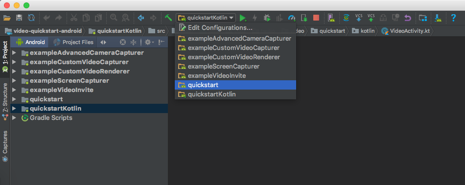
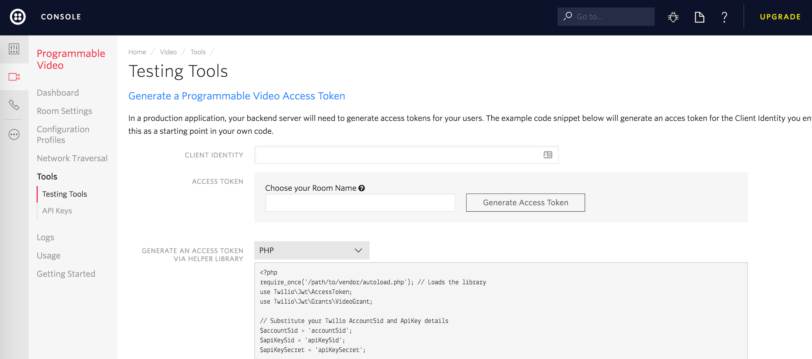
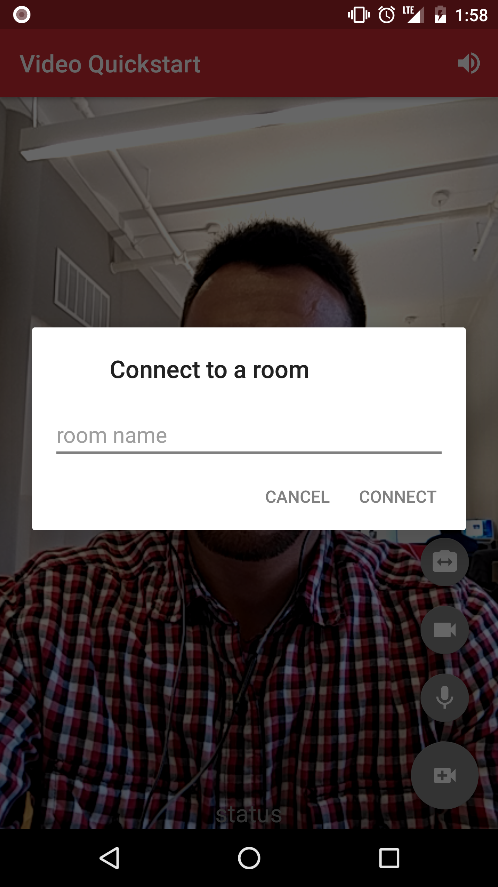
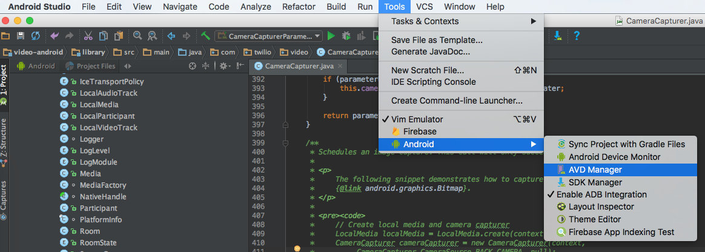
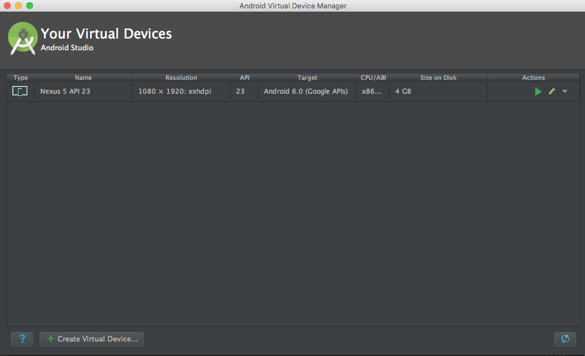
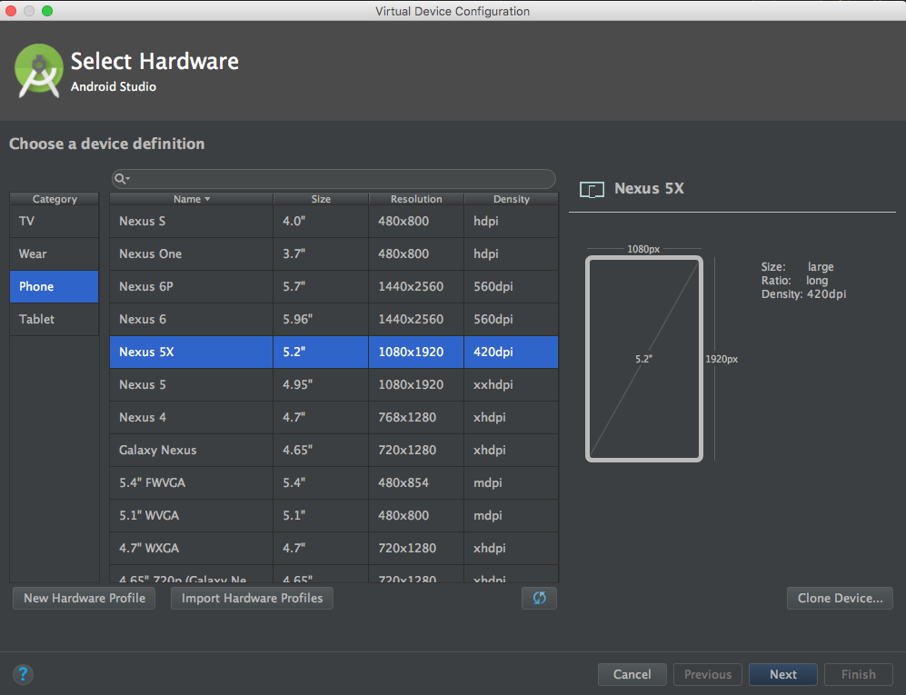
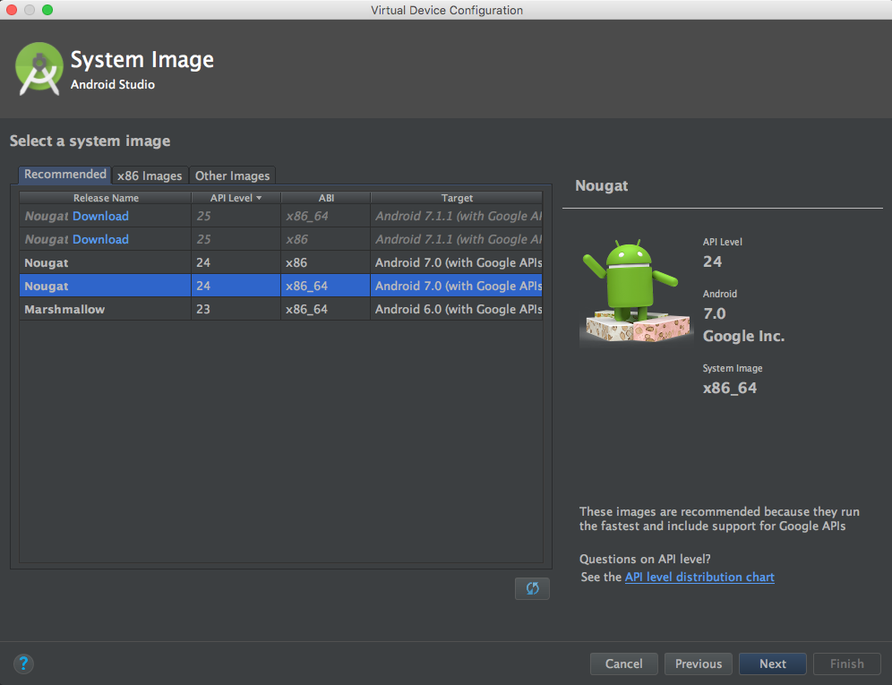
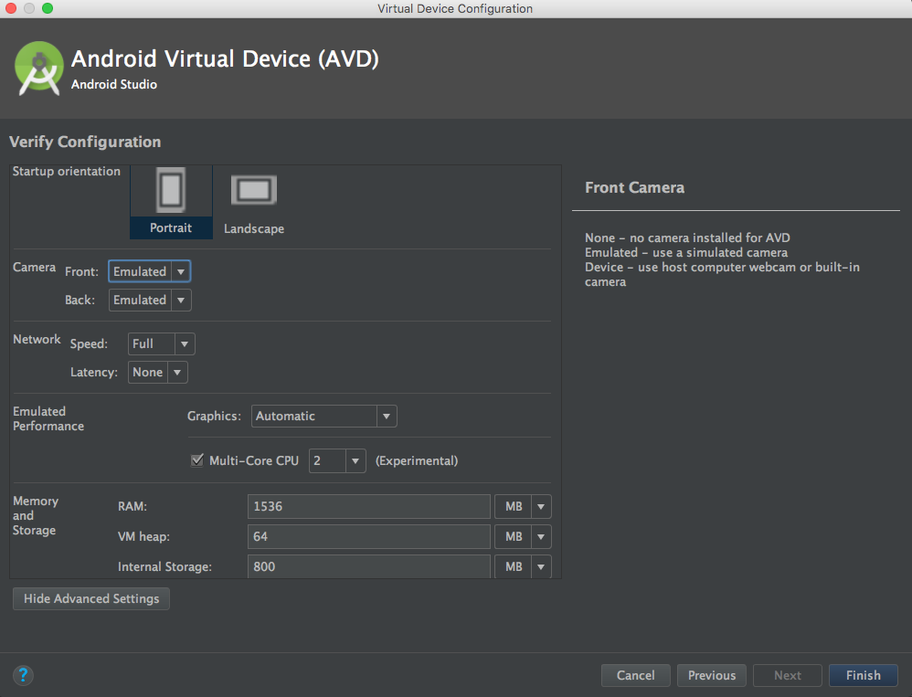
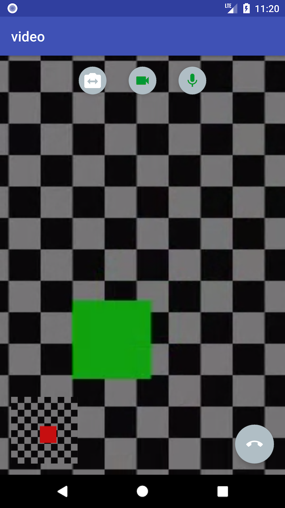

[](https://twilio.github.io/twilio-video-android/docs/latest/)

> NOTE: These sample applications use the Twilio Video 3.x APIs. For examples using our 1.x APIs, please see
the [1.x](https://github.com/twilio/video-quickstart-android/tree/1.x) branch. For examples using our 2.x APIs, please see
the [2.x](https://github.com/twilio/video-quickstart-android/tree/2.x) branch.

# Twilio Video Quickstart for Android

Get started with Video on Android:

- [Quickstart](#quickstart) - Run the quickstart app
- [Examples](#examples) - Customize your video experience with these examples
- [Using an Emulator](#using-an-emulator) - Setup an emulator in Android Studio
- [Reducing APK Size](#reducing-apk-size) - Use ABI splits to reduce your APK size
- [Troubleshooting Audio](#troubleshooting-audio) - Mitigate audio issues in your application
- [Rendering Video](#rendering-video) - A guide to rendering video in your application
- [Setup an Access Token Server](#setup-an-access-token-server) - Setup an access token server
- [More Documentation](#more-documentation) - More documentation related to the Video Android SDK
- [Issues & Support](#issues-and-support) - Filing issues and general support

## Quickstart

To get started with the Quickstart application follow these steps:

1. Open this project in Android Studio and select the quickstart or quickstartKotlin app module.
  

2. Type in an identity and click on "Generate Access Token" from the [Testing Tools page](https://www.twilio.com/console/video/runtime/testing-tools).
  

3. Add the access token string copied from the console to a variable named `TWILIO_ACCESS_TOKEN` 
in your **local.properties** file.

```
TWILIO_ACCESS_TOKEN=abcdef0123456789
```

4. Run the quickstart app on an Android device or Android emulator.

5. Press the video call button at the bottom right portion of the screen and type a room name to connect to a Room.
  

6. On another device, use an additional access token with a different identity to connect to the same room. 

## Examples
In addition to the quickstart we've also added a few examples of use cases that show you how to create and customize your media as follows:

- [Custom Video Capturer](exampleCustomVideoCapturer) - Demonstrates how a custom `VideoCapturer` can be implemented to capture the contents of a `View`. 
- [Custom Video Renderer](exampleCustomVideoRenderer) - Demonstrates how to implement a custom `VideoRenderer` that captures a `Bitmap` of the last rendered frame.
- [Screen Capturer](exampleScreenCapturer) - Demonstrates how to use the screen capturer.
- [Advanced Camera Capturer](exampleAdvancedCameraCapturer) - Demonstrates advanced use cases of `CameraCapturer` like injecting custom camera paremeters.
- [Video Invite](exampleVideoInvite) - Demonstrates how to use Twilio Notify to invite other participants to a room.
- [Data Tracks](exampleDataTrack) - Demonstrates how to use `DataTrack`s to write a simple collaborative drawing app.
- [Audio Sink](exampleAudioSink) - Demonstrates writing raw PCM audio to a .wav file from a `RemoteAudioTrack` using `AudioSink`.
- [Multi Party Video](exampleMultipartyVideo) - Demonstrates a conference style video call with up to four participants.

## Using an Emulator

Using an Emulator
This guide will walk you through setting up and emulator that is compatible with the Video SDK.

### Requirements
1. Android Studio 2.0+

### Guide
1. Open Android Studio and navigate to Tools → Android → AVD Manager.
  
2. Create a virtual device.
  
3. Select your desired device.
  
4. Select a system image. We recommend either x86 or x86_64 images.
  
5. Click “Show Advanced Settings” and we recommend setting both cameras as “Emulated”. Note that other camera configurations will work with the exception of setting both cameras as “webcam()”.
  
6. Configure the rest of your device accordingly and click “Finish”.

## Reducing APK Size

Our library is built using native libriares. As a result, if you use the default gradle build you will generate an APK with all four architectures(armeabi-v7a, arm64-v8a, x86, x86_64 in your APK.

[APK splits](https://developer.android.com/studio/build/configure-apk-splits.html) allow developers to build multiple APKs for different screen sizes and ABIs. Enabling APK splits ensures that the minimum amount of files required to support a particular device are packaged into an APK.

The following snippet shows an example `build.gradle` with APK splits enabled.

    apply plugin: 'com.android.application'
    
    android {
        compileSdkVersion 24
        buildToolsVersion "24.0.2"
    
        defaultConfig {
            applicationId "com.twilio.video.quickstart"
            minSdkVersion 16
            targetSdkVersion 24
            versionCode 1
            versionName "1.0"
        }
    
        // Specify that we want to split up the APK based on ABI
        splits {
            abi {
                // Enable ABI split
                enable true
    
                // Clear list of ABIs
                reset()
    
                // Specify each architecture currently supported by the Video SDK
                include "armeabi-v7a", "arm64-v8a", "x86", "x86_64"
    
                // Specify that we do not want an additional universal SDK
                universalApk false
            }
        }
    }
    
    dependencies {
        compile "com.twilio:video-android:5.0.1"
    }

The adoption of APK splits requires developers to submit multiple APKs to the Play Store. Refer to [Google’s documentation](https://developer.android.com/google/play/publishing/multiple-apks.html) for how to support this in your application.

## Troubleshooting Audio
The following sections provide guidance on how to ensure optimal audio quality in your applications. Results may vary when using APIs within the `org.webrtc` package. While we expose these APIs we do not actively test their usage.

### Configuring AudioManager
The following snippet shows how to configure 
[AudioManager](https://developer.android.com/reference/android/media/AudioManager.html) for optimal 
experience when sharing audio to a `Room`.

    private void configureAudio(boolean enable) {
        if (enable) {
            previousAudioMode = audioManager.getMode();
            // Request audio focus before making any device switch.
            requestAudioFocus();
            /*
             * Use MODE_IN_COMMUNICATION as the default audio mode. It is required
             * to be in this mode when playout and/or recording starts for the best
             * possible VoIP performance. Some devices have difficulties with
             * speaker mode if this is not set.
             */
            audioManager.setMode(AudioManager.MODE_IN_COMMUNICATION);
            /*
             * Always disable microphone mute during a WebRTC call.
             */
            previousMicrophoneMute = audioManager.isMicrophoneMute();
            audioManager.setMicrophoneMute(false);
        } else {
            audioManager.setMode(previousAudioMode);
            audioManager.abandonAudioFocus(null);
            audioManager.setMicrophoneMute(previousMicrophoneMute);
        }
    }

    private void requestAudioFocus() {
        if (Build.VERSION.SDK_INT >= Build.VERSION_CODES.O) {
            AudioAttributes playbackAttributes = new AudioAttributes.Builder()
                    .setUsage(AudioAttributes.USAGE_VOICE_COMMUNICATION)
                    .setContentType(AudioAttributes.CONTENT_TYPE_SPEECH)
                    .build();
            AudioFocusRequest focusRequest =
                    new AudioFocusRequest.Builder(AudioManager.AUDIOFOCUS_GAIN_TRANSIENT)
                            .setAudioAttributes(playbackAttributes)
                            .setAcceptsDelayedFocusGain(true)
                            .setOnAudioFocusChangeListener(
                                    new AudioManager.OnAudioFocusChangeListener() {
                                        @Override
                                        public void onAudioFocusChange(int i) { }
                                    })
                            .build();
            audioManager.requestAudioFocus(focusRequest);
        } else {
            audioManager.requestAudioFocus(null, AudioManager.STREAM_VOICE_CALL,
                    AudioManager.AUDIOFOCUS_GAIN_TRANSIENT);
        }
    }

### Configuring Hardware Audio Effects
Our library performs acoustic echo cancellation (AEC), noise suppression (NS), and auto gain 
control (AGC) using device hardware by default. Using device hardware is more efficient, but some 
devices do not implement these audio effects well. If you are experiencing echo, background noise, 
or unexpected volume levels on certain devices reference the following snippet for enabling 
software implementations of AEC, NS, and AGC.

    /*
     * Execute any time before creating a LocalAudioTrack and connecting 
     * to a Room.
     */
    
    // Use software AEC
    WebRtcAudioUtils.setWebRtcBasedAcousticEchoCanceler(true);
    
    // Use sofware NS
    WebRtcAudioUtils.setWebRtcBasedNoiseSuppressor(true);
    
    // Use software AGC
    WebRtcAudioUtils.setWebRtcBasedAutomaticGainControl(true);
    
### Configuring OpenSL ES
Our library will use [OpenSL ES](https://developer.android.com/ndk/guides/audio/opensl/index.html)
for audio playback if the device is compatible. Using OpenSL ES is more efficient, but can cause
problems with other audio effects. For example, we found on the Nexus 6P that OpenSL ES affected
the device's hardware echo canceller so we blacklisted the Nexus 6P from using OpenSL ES. If you 
are experiencing audio problems with a device that cannot be resolved using software audio 
effects, reference the following snippet for enabling OpenSL ES:

    /*
     * Execute any time before creating a LocalAudioTrack and connecting 
     * to a Room.
     */
    
    // Disable OpenSL ES 
    WebRtcAudioManager.setBlacklistDeviceForOpenSLESUsage(true);
    
    // Check if OpenSL ES is disabled 
    WebRtcAudioUtils.deviceIsBlacklistedForOpenSLESUsage()

### Managing Device Specific Configurations
The Video Android SDK does not maintain a list of devices for which hardware effects or OpenSL ES are disabled. We recommend maintaining a list in your own application and disabling these effects as needed. The [Signal App provides a great example](https://github.com/signalapp/Signal-Android/blob/master/src/org/thoughtcrime/securesms/ApplicationContext.java#L250) of how to maintain a list and disable the effects as needed.

### Known Issues
- Using the following WebRTC based acoustic echo canceler on the Pixel 3 XL will disable the microphone system wide. <br>
Usage: `WebRtcAudioUtils.setWebRtcBasedAcousticEchoCanceler(true);`<br> A bug has been filed with WebRTC and can be found [here](https://bugs.chromium.org/p/webrtc/issues/detail?id=10386#c1).
    
## Rendering Video 
A `VideoTrack` can be rendered in your application using `addRenderer` which takes an
implementation of `VideoRenderer`. A `VideoRenderer` is most commonly used to render video to a UI,
but could be used for other scenarios such as rendering to a file. The following section provides 
guidance on how to render video in your application.

### Working with VideoView
For simply rendering video to your application's UI, we recommend using `VideoView`. `VideoView` extends
`SurfaceView` and can be added to your view hierarchy in a layout file or programmatically. To render
a `VideoTrack` to a `VideoView` simply call `videoTrack.addRenderer(videoView)`. The
following snippets demonstrate how to setup the a thumbnail video overlayed on a primary video as
seen in the screenshot below.



#### VideoView in a Layout File 

    <?xml version="1.0" encoding="utf-8"?>
    <FrameLayout xmlns:android="http://schemas.android.com/apk/res/android"
                 xmlns:app="http://schemas.android.com/apk/res-auto"
                 android:id="@+id/video_container"
                 android:layout_width="match_parent"
                 android:layout_height="match_parent"
                 android:keepScreenOn="true">

        <com.twilio.video.VideoView
            android:id="@+id/thumbnail_video_view"
            app:overlaySurface="true"
            app:mirror="true"
            android:layout_width="96dp"
            android:layout_height="146dp"
            android:layout_margin="16dp"
            android:layout_gravity="bottom|start"/>

        <com.twilio.video.VideoView
            android:id="@+id/primary_video_view"
            android:layout_width="match_parent"
            android:layout_height="match_parent" />
            
    </FrameLayout>


#### Adding VideoView Programmatically

    /*
     * Get videoContainer
     */
    FrameLayout videoContainer = findViewById(R.id.video_container);

    /*
     * Create thumbnail video view
     */
    VideoView thumbnailVideoView = new VideoView(context);

    /*
     * Mirror the video. Set to true when rendering video from a local video track using the 
     * front facing camera. Set to false otherwise.
     */
    thumbnailVideoView.setMirror(true);

    /*
     * Overlays the thumbnail video view on top of the primary video view
     */
    thumbnailVideoView.applyZOrder(true);

    /*
     * Create primary video view
     */
    VideoView primaryVideoView = new VideoView(context);

    /*
     * Add video views to container
     */
    videoContainer.addView(thumbnailVideoView);
    videoContainer.addView(primaryVideoView);


### Custom Renderers and I420Frame
For advanced use cases you can provide a custom `VideoRenderer` where your custom renderer will be
provided with an `I420Frame` to render. An `I420Frame` can be represented with a ByteBuffer array 
of Y, U, and V pixel data with an array of strides for each plane or as a texture. When a frame is 
represented as a texture, `I420Frame#textureId` will be set to a positive non zero value with 
`I420Frame#yuvPlanes` and `I420Frame#yuvStrides` set to `null`. The YUV data can be extracted from 
the texture using an instance of `org.webrtc.YuvConverter` and the `I420Frame#samplingMatrix`. When 
a frame is represented as an array of `ByteBuffer`, `I420Frame#textureId` will be 0, 
`I420Frame#yuvPlanes` contains the YUV pixel data, and `I420Frame#yuvStrides` contains each plane's 
stride. For an example of implementing a custom `VideoRenderer` we recommend referencing the
[Custom Video Renderer](exampleCustomVideoRenderer) module.


## Setup an Access Token Server

Using Twilio's Video client within your applications requires an access token. 

You can run your own server that provides access tokens, based on your Twilio credentials. This server can either run locally on your development machine, or it can be installed on a server. If you run the server on your local machine, you should use the [ngrok](https://ngrok.com/download) utility to give the server an externally accessible web address. That way, you can run the quickstart app on an Android device.

### Configuring the Access Token Server

If you want to be a little closer to a real environment, you can download one of the video quickstart applications - for instance, [Video Quickstart: Node](https://github.com/TwilioDevEd/video-quickstart-node) and either run it locally, or install it on a server.

You'll need to gather a couple of configuration options from your Twilio developer console before running it, so read the directions on the quickstart. You'll copy the .env.example file to a .env file, and then add in these credentials:
 
Credential | Description
---------- | -----------
Twilio Account SID | Your main Twilio account identifier - [find it on your dashboard](https://www.twilio.com/console).
API Key | Used to authenticate - [generate one here](https://www.twilio.com/console/video/runtime/api-keys).
API Secret | Used to authenticate - [just like the above, you'll get one here](https://www.twilio.com/console/video/runtime/api-keys).

#### A Note on API Keys

When you generate an API key pair at the URLs above, your API Secret will only
be shown once - make sure to save this in a secure location.

#### Running the Video Quickstart with ngrok

If you run your video chat application on an Android device, you'll need to provide an externally accessible URL for the app. The [ngrok](https://ngrok.com/) tool creates a publicly accessible URL that you can use to send HTTP/HTTPS traffic to a server running on your localhost. Use HTTPS to make web connections that retrieve a Twilio access token.

When you get a URL from ngrok, go ahead and update **local.properties**. Reference the following 
snippet.

```
# Insert the URL from ngrok
TWILIO_ACCESS_TOKEN_SERVER=http://localhost:3000

# Inform quickstart you want to use a token server
USE_TOKEN_SERVER=true
```

## More Documentation

You can find more documentation on getting started as well as our latest Javadoc below:

* [Getting Started](https://www.twilio.com/docs/video/getting-started)
* [Javadoc](https://twilio.github.io/twilio-video-android/docs/latest/)

## Issues and Support

Please file any issues you find here on Github.
Please ensure that you are not sharing any
[Personally Identifiable Information(PII)](https://www.twilio.com/docs/glossary/what-is-personally-identifiable-information-pii)
or sensitive account information (API keys, credentials, etc.) when reporting an issue.

For general inquiries related to the Video SDK you can file a [support ticket](https://support.twilio.com/hc/en-us/requests/new)

