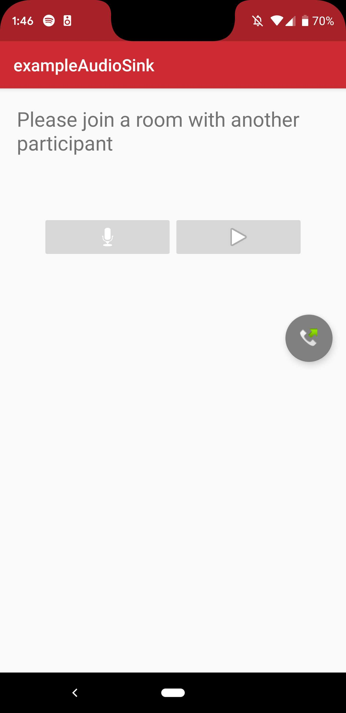
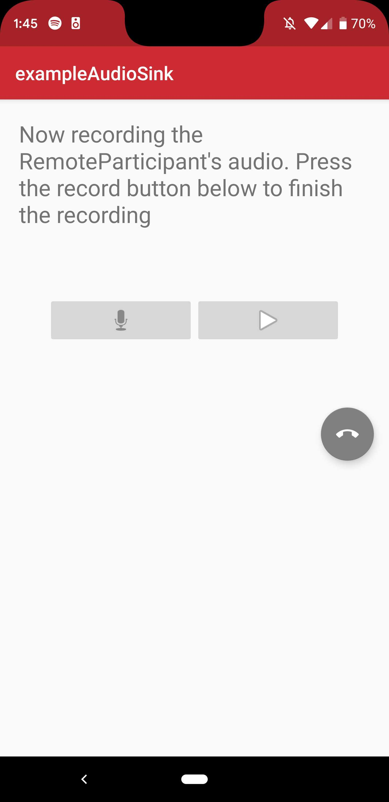
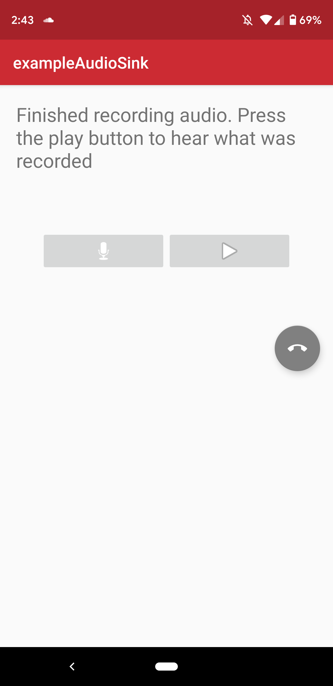

# Twilio Video AudioSink Example

The project demonstrates how to use Twilio's Programmable Video SDK to access raw audio samples using the `AudioSink` API on `AudioTrack`.

### Setup

See the master [README](https://github.com/twilio/video-quickstart-android/blob/master/README.md) for instructions on how to generate access tokens and connect to a Room.

This example requires Android Studio as well as two devices running Android API level 16 or higher.

### Running

Once you have setup your access token, install and run the example. You will be presented with the following screen:

<kbd></kbd>

After you connect to a Room on two devices tap the microphone icon to begin recording the `RemoteParticipant` audio stream. Tap again to stop the recording.

<kbd></kbd>

You can listen to the recorded .wav file by tapping on the play icon

<kbd></kbd>

### Known Issues

1. Local audio samples are not raised until at least one underlying WebRTC PeerConnection is negotiated. In a Peer-to-Peer Room it is not possible to record or recognize audio until at least one other Participant joins. The same limitation does not apply to Group Rooms where there is a persistent PeerConnection with Twilio's media servers.