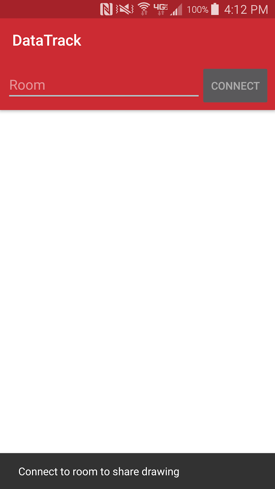
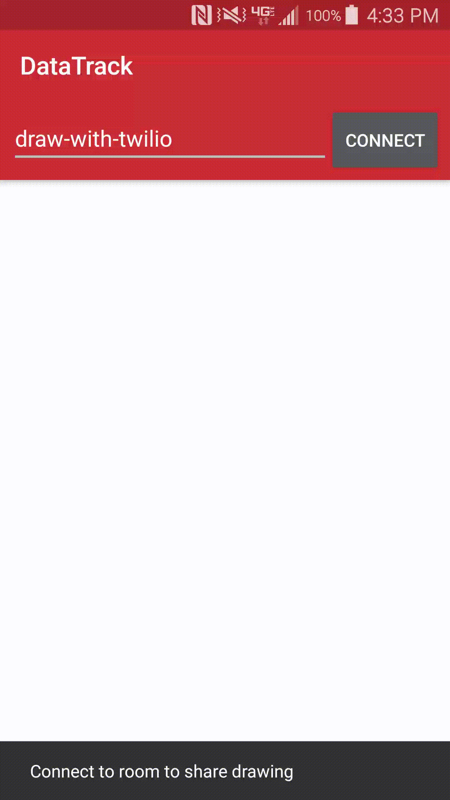

# Twilio Data Tracks

The DataTrack API lets you create a DataTrack channel which can be used to send low latency 
messages to zero or more receivers subscribed to the data. For a detailed guide about DataTracks
reference [our documentation](https://www.twilio.com/docs/api/video/using-the-datatrack-api). 
 
This example illustrates how to use the DataTrack API to write a simple collaborative drawing app. 

In this example, participants can join a room and begin drawing on a canvas. The drawing is shared
to all other participants using the DataTrack API to provide a collaborative whiteboard experience.
Once disconnected from a room your canvas clears and your drawings are removed from all other
participant's canvases. Each participant's drawings will be presented in a unique color.


## Getting Started

To get started with this example you will need to perform the following steps:

1. [Access token setup](#bullet1)
2. [Run the application](#bullet2)
3. [Connect and draw!](#bullet3)

### <a name="bullet1"></a>Access token setup 

An access token is required to connect to a room. There are two options for retrieving an access
token.

##### Add token to local.properties
You can paste your token as an entry in your local.properties file. See example below:

```
TWILIO_ACCESS_TOKEN=YOUR_ACCESS_TOKEN
```

##### Add token server to local.properties 
You can use a token server you setup with [our guide](https://github.com/twilio/video-quickstart-android#setup-an-access-token-server) 
to retrieve tokens at runtime. See example below.

```
TWILIO_ACCESS_TOKEN_SERVER=http://localhost:3000

# Default value is false
USE_TOKEN_SERVER=true
```


### <a name="bullet2"></a>Run the application 

Once you have setup your access token you can run the application and you will be presented with
the following screen:



Before connecting to the screen the canvas is disabled. To start drawing connect to a room.

### <a name="bullet3"></a>Connect and draw! 

Once connected you can start drawing and see other connected participant's drawing.


