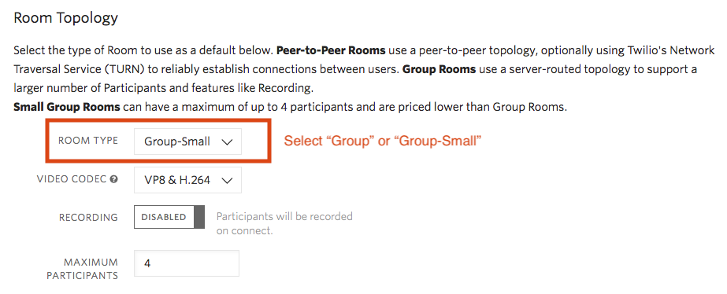
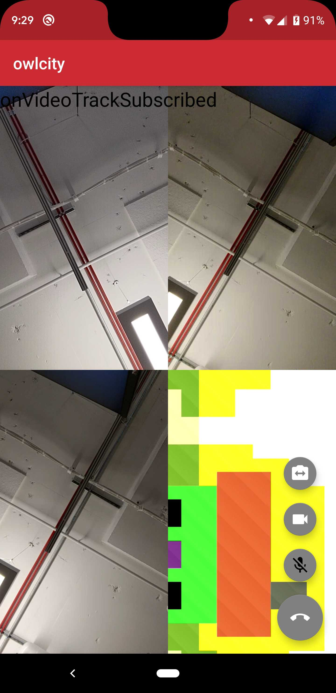

# Twilio Video Multi-Party Example

The project demonstrates how to use Twilio's Programmable Video SDK for multi-party conferencing with up to 4 Participants in a Group Room.

### Breaking down MultiPartyActivity.java

`MultiPartyActivity.java` comprises the main functionality of the app and handles the following:

1. Configuring local audio & video Tracks.
2. Connecting to the Room.
3. Rendering local and remote video.
4. Raising fatal errors to the developer.
5. Disconnecting from the Room, and stopping the `CameraCapturer`.

### Setup

See the master [README](https://github.com/twilio/video-quickstart-android/blob/master/README.md) for instructions on how to generate access tokens that are needed to connect to a Room.

You will need to provide a hardcoded token, or token server URL in `local.properties`. Please note that this example is designed to work in a Group Room, including the usage of [VP8 Simulcast](https://www.twilio.com/docs/video/tutorials/working-with-vp8-simulcast). You can create Group Rooms using the [REST API](https://www.twilio.com/docs/video/api/rooms-resource), or by selecting them as the default type in the [console](https://www.twilio.com/console/video/configure).

<kbd></kbd>

This example requires Android Studio 3.0 or higher, as well as a device or simulator running Android 4.2 (JELLY BEAN) or above.

<kbd></kbd>

### Known Issues

**1. Defaults are inefficient for Peer-to-Peer**

This app is designed to be used in a Group Room. If you join a Peer-to-Peer Room then simulcast will still be enabled by default. The Client has no way to disable simulcast after connecting, beacuse it is ignorant of the Room type that is being used.