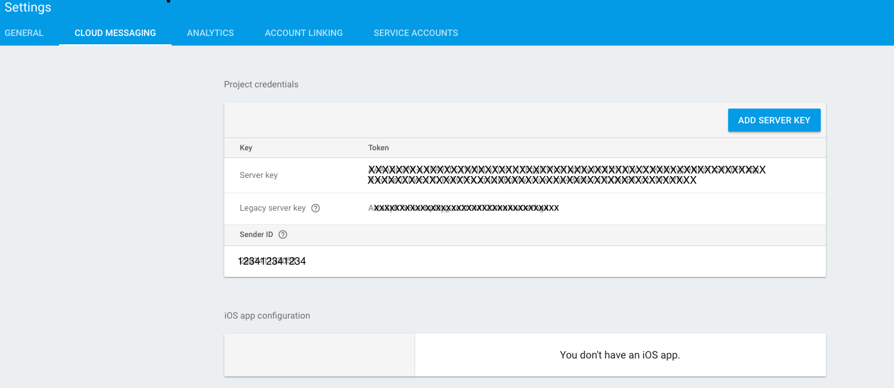
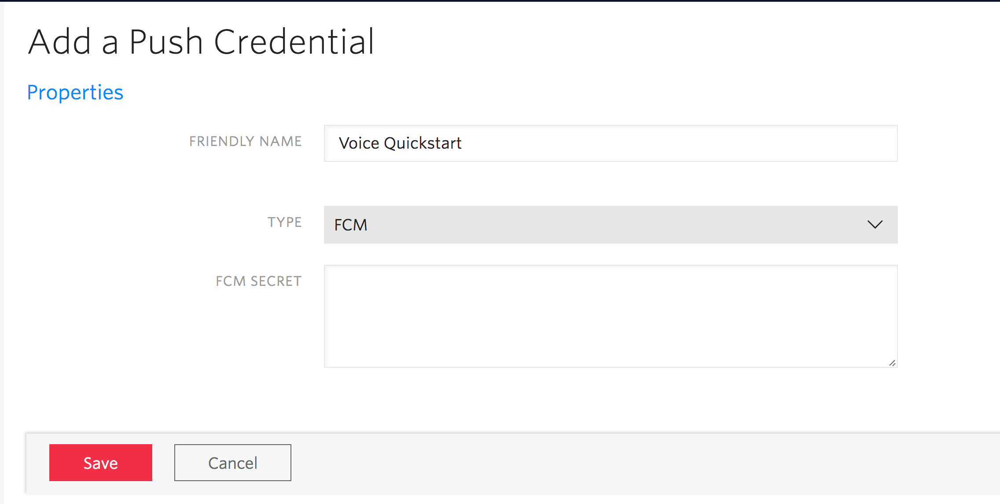

# Twilio Video Invite

There are many use cases using real-time video that require inviting, notifying, or calling other
interested parties to join a video session in real-time.

This example illustrates how to do so using push notifications via
[Twilio Notify](https://twilio.com/notify) enabling you to notify other participants to join a named video
room via GCM, FCM, APNS and other channels.

In this example, when a participant joins a named video room it notifies all other participants
that have registered with binding tag `video` using Twilio Notify.

If you want to learn more about Twilio Notify before getting started please see the docs
[here](https://www.twilio.com/docs/api/notify).

## Getting Started

To get started with this example you will need to perform the following steps:

1. [Generate google-services.json](#bullet1)
2. [Add a Push Credential using your FCM Server API Key](#bullet2)
3. [Download the SDK Starter project](#bullet3)
4. [Start the SDK Starter project](#bullet4)

### 1. Generate `google-services.json`

The example uses Firebase Cloud Messaging push notifications to notify others when a participant
joins a video room. In order to enable this functionality, you’ll need to enable FCM in your application.

Follow the steps under **Use the Firebase Assistant** in the [Firebase Developers Guide](https://firebase.google.com/docs/android/setup).
Once you connect and sync to Firebase successfully, you will be able to download the `google-services.json` for your application.

Login to Firebase console and make a note of generated `Server API Key` and `Sender ID` in your notepad. You will need them in the next step.

"

Make sure the generated `google-services.json` is downloaded to the `exampleVideoInvite` directory of the quickstart project to replace the existing `exampleVideoInvite/google-services.json` stub json file. If you are using the Firebase plugin make sure to remove the stub `google-services.json` file first.

As a final step re-run the application from Android Studio to ensure the APK now has the latest `google-services.json` file.

### 2. Add a Push Credential using your FCM `Server API Key`

You will need to store the FCM `Server API Key` with Twilio so that we can send push notifications to your app on your behalf. Once you store the API Key with Twilio, it will get assigned a Push Credential SID so that you can later specify which key we should use to send push notifications.

Go to the [Push Credentials page](https://www.twilio.com/console/notify/credentials) and create a new Push Credential.

Paste in the `Server API Key` and press Save.

"

### 3. Download the SDK Starter project

Go to the [SDK Starter Java](https://github.com/TwilioDevEd/sdk-starter-java) project.

Follow the steps in the `README.md` to configure Twilio Video and Twilio Notify. When you create
the Notify Service make sure you select the FCM credential that you created in the previous step.

### 4. Start the SDK Starter project

Type `source .env; node .`

Using ngrok type `ngrok http 3000`

### 5. Run the application

Update the `TWILIO_SDK_STARTER_SERVER_URL` in `local.properties` with the url provided by ngrok and run the example
on at least two devices. Once both devices are registered use one of the devices to connect to a room.
The other device should receive a push notification alerting them to join the room.
